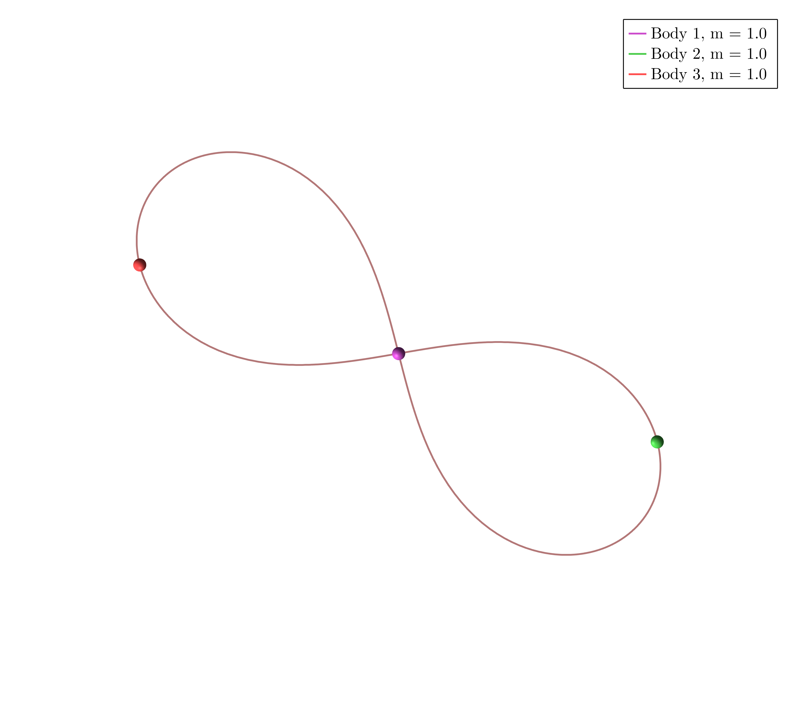
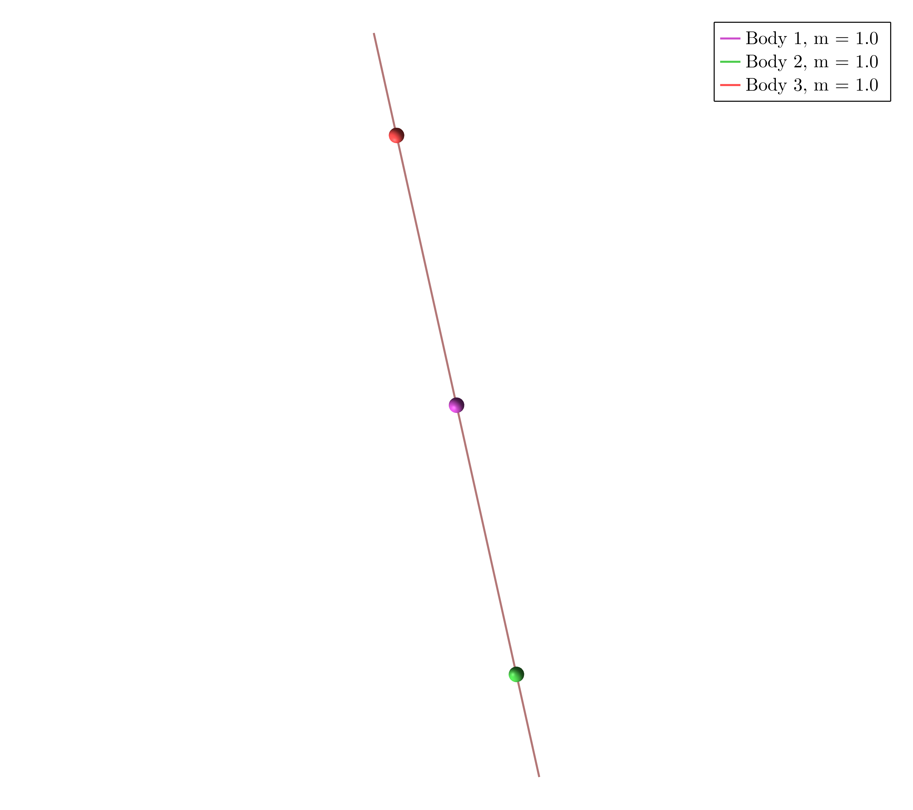

# Example 1

Download the Jupyter Notebook [here](assets/examples1.ipynb)


In $\mathbb R^2$ take three masses $m_1 = m_2 = m_3 = 1$ and consider the dihedral group generated by $r$ and $s$ such that


```math
	\rho(r) = \mathrm{Id}_2 ,
	\quad 
	\rho(s) = -\mathrm{Id}_2 ,
```
```math
	\sigma(r) = (1,2,3),
	\quad 
	\sigma(s) = (1,2).
```

```@julia
using SymOrb, GLMakie
P = initialize("symmetries/D6.toml");
```

### Orbit a)



```@julia
starting_path = [0.9910444029362174, 0.5114641799428149, 0.5419239049744543, 0.3599974995607571, 0.8655300706280167, 0.7834315285871338, 0.29704045156480774, 0.4095187697543997, 0.2307161344179094, 0.3334421987099567, 0.9523516377107533, 0.6773825989644467, 0.7333820441601945, 0.18259838354711477, 0.7843030396569594, 0.04315606211296397, 0.19847559869955023, 0.03580031254297367, 0.1338658395604284, 0.433052097662472, 0.04101434089950773, 0.10974419527303458, 0.27437492389016216, 0.6758281575419561, 0.5165989428650567, 0.1362795495466529, 0.36531522100909497, 0.7588950222705241, 0.45260771362490415, 0.8333232445746165, 0.0868666269833046, 0.8384687700209725, 0.9889030887957154, 0.8666510695937162, 0.6474409897470846, 0.03603639729689101, 0.47418455468724374, 0.6170704960365335, 0.17624957818195497, 0.5793662555870891, 0.13456060756499844, 0.13605884792505785, 0.30185196510538836, 0.7130614833481256, 0.05956262357411757, 0.08850761861990708, 0.9489853788985407, 0.6052702206565074, 0.23347144892083604, 0.591849136016863, 0.4602327573696645, 0.21138320128885357, 0.4533900833576492, 0.16197105257002364, 0.0293994905893894, 0.5811615022613295, 0.2109891334303784, 0.9531226404766451, 0.5584829608937774, 0.4719989236244584, 0.5094637152307636, 0.793687109174142, 0.5509514800323008, 0.5392005016744927, 0.847972555448702, 0.7840275643625197, 0.6451727214845161, 0.49981773174557775, 0.015453509334088844, 0.40918584839880945, 0.5713040929605344, 0.5126725577616561, 0.5573849780621619, 0.9194546123688985, 0.3491427015275469, 0.9818592385379191, 0.6200647688625031, 0.24880939565061144, 0.30953568496492423, 0.08138450378653717, 0.313179724687742, 0.91090584979289, 0.3226448240513049, 0.957582452844969, 0.5052051634962647, 0.9863021926176972, 0.11063874030851306, 0.640223729921016, 0.8042764955583538, 0.26222526332061313, 0.45065092086915537, 0.4786728254457431, 0.9978739546952787, 0.5907717011811477, 0.9751801139303751, 0.001860362682031269, 0.19728072734783775, 0.8576953286825678, 0.6918371096111301, 0.08975562889267574, 0.4400942868467431, 0.5517206714980416, 0.9916618208403764, 0.636656490472127]
orbits = find_orbits(P, starting_path=starting_path)
path_animation(P, orbits[1].fourier_coeff)
```

### Orbit b)


```@julia
starting_path = [0.8500724958354298, 0.2965075710017815, 0.4038843850920646, 0.9593171772181317, 0.576169496616133, 0.5097696176345637, 0.8111667398182991, 0.8031500563158854, 0.6523753415176737, 0.9391758660648502, 0.3707650700840597, 0.14171111959984184, 0.5422840581357207, 0.5920229867132981, 0.802205311009409, 0.02516094718792694, 0.5064308773841223, 0.46148210682502544, 0.18485303725382385, 0.5655084586032478, 0.3807490011488318, 0.44257674477505904, 0.06937043491482031, 0.28006151247274047, 0.9103437154084043, 0.3078069495374586, 0.45979328920833196, 0.5191775266145024, 0.28829312010337793, 0.008047656801859704, 0.30814024818679486, 0.10821489345002089, 0.39039845533803397, 0.7257655109562617, 0.9412750933906926, 0.18401305391884237, 0.3529706294972639, 0.42953117186307965, 0.5515299718672357, 0.40522426394606414, 0.31905690632117634, 0.14423786279011197, 0.8943297608610732, 0.7962009909461721, 0.17095924258258532, 0.612156304536054, 0.6417399581304083, 0.8314012386616806, 0.9872378412923518, 0.6268434730624085, 0.11194440204261147, 0.3331572815960483, 0.3409104933744711, 0.047337783776315034, 0.814847486636577, 0.931122029780945, 0.31042167972409684, 0.8219107459684699, 0.07292848923786244, 0.275158634635967, 0.598191037704678, 0.7062611056635586, 0.7904585512896665, 0.2651598725678439, 0.381696604088712, 0.7458579791412505, 0.6506195641136985, 0.9332405360633436, 0.11612835141229139, 0.4168661708808067, 0.2664712947019746, 0.1863469759192835, 0.6813735070684833, 0.3418217569834465, 0.6510114124589256, 0.7365881321791036, 0.5902179677239102, 0.986259082498559, 0.3697089244467051, 0.8056959434983377, 0.12326154310947746, 0.6531029095487367, 0.3612791821456086, 0.5347061758042625, 0.2225202975387952, 0.004746103526632961, 0.20945337355680105, 0.2150783653238243, 0.5598805573116848, 0.5546422838217823, 0.6883849897310804, 0.2665042743409828, 0.8143424441420659, 0.8921467291442896, 0.7196330990839562, 0.6336736032424715, 0.01138816375051166, 0.8194174083528404, 0.5763858609279028, 0.6344073623355704, 0.9321117015723098, 0.29254960814344966, 0.8522223156295748, 0.20001566372337576]
orbits = find_orbits(P, OneMethod(Newton(200)), starting_path=starting_path)
path_animation(P, orbits[1].fourier_coeff)
```


