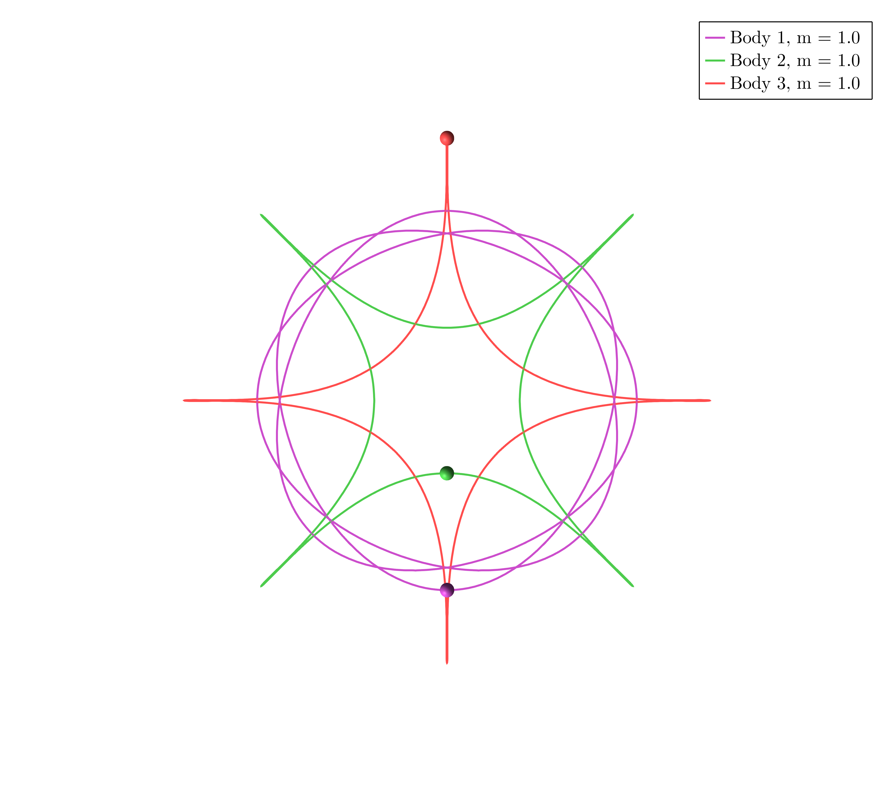
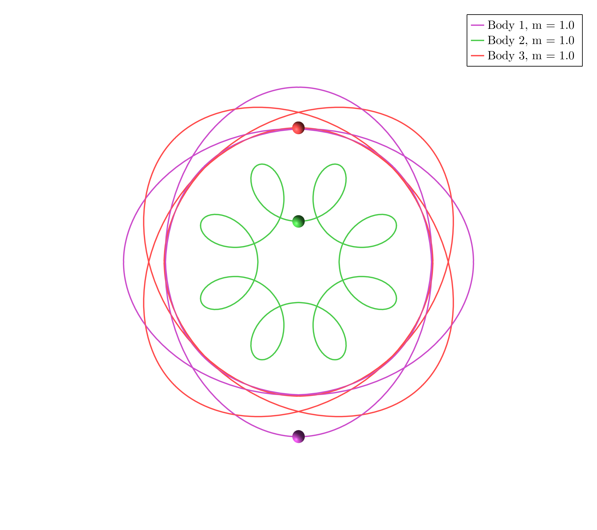

# Example 2

Download the Jupyter Notebook [here](assets/examples2.ipynb)


In $\mathbb R^2$ take three masses $m_1 = m_2 = m_3 = 1$ and consider the dihedral group generated by $r$ and $s$ such that

```math
	\rho(r) = \begin{pmatrix} 0 & 1 \\ -1 & 0\end{pmatrix},
	\quad 
	\rho(s) = \begin{pmatrix} 1 & 0 \\ 0 & -1\end{pmatrix},
```
```math
	\sigma(s) = (),
	\quad 
	\sigma(r) = ().
```

```@julia
using SymOrb, GLMakie
P = initialize("dihedral_45.toml");
```

### Orbit a)



```@julia 
starting_path = [0.7023529554928476, 0.9192999889258953, 0.6357526692057539, 0.8485095789987379, 0.25010844963887324, 0.5971989255289822, 0.6550064750566129, 0.533459198110729, 0.945573467284529, 0.6356916988554068, 0.35282914889403116, 0.7763784181766863, 0.9170208954332018, 0.5995831360334397, 0.6053622592438642, 0.28179342670975527, 0.5436574375151708, 0.7989312117273241, 0.40620106932516753, 0.3407390151107367, 0.30049445426572574, 0.33055322617644733, 0.11587973030010179, 0.6931126430535223, 0.13346176724801895, 0.7295553224164065, 0.884455720273531, 0.6679234088287881, 0.09367893786249526, 0.20274345251742432, 0.8979170420014636, 0.5818865965685236, 0.41878414658723073, 0.7343819234595733, 0.9275739565618097, 0.17151037763785804, 0.44296688411926366, 0.20658621086654683, 0.3848143896677956, 0.6573449453636154, 0.846799847438515, 0.006869388020608214, 0.9005313848553692, 0.16299707316622736, 0.745596964942212, 0.3058320632896697, 0.6538406714486558, 0.02479641786199427, 0.1999103516255487, 0.3755735617501468, 0.6097413801526839, 0.7819892926457264, 0.28349548617988196, 0.14877095113937322, 0.9434446222359052, 0.9945150232911776, 0.033870480702034356, 0.6735172117769502, 0.6923302779608616, 0.2728626998015051, 0.24392683442730412, 0.47511197054670085, 0.6867472997654916, 0.7308676154487728, 0.5411073191878031, 0.09405939751474512, 0.9347631203023354, 0.6591660404875208, 0.9534530321839946, 0.08535909631531935, 0.59948885649545, 0.01375597354351954, 0.526913192601255, 0.5619429501356537, 0.11242850704817497, 0.37741145761962147, 0.5548192854745956, 0.3963963378272187, 0.45511806942120014, 0.028242043749001078, 0.9968295684292002, 0.15106309812715035, 0.8694484717878385, 0.3141999704554098, 0.1579979442076228, 0.6489472342464601, 0.3203729255956651, 0.29186268966769935, 0.8080263625658191, 0.42738558530715987, 0.14772644362292897, 0.5293877332103841, 0.2171393535488617, 0.322254222119582, 0.7352183248422101, 0.21611418264706828, 0.8412029826282246, 0.682947198544198, 0.18009747094051598, 0.9004110263096429, 0.5661698206153502, 0.8121637119872606, 0.5714673723119401, 0.3033104590163196]
orbits = find_orbits(P, OneMethod(BFGS(200)), starting_path=starting_path)
path_animation(P, orbits[1].fourier_coeff)
```

### Orbit b)


```@julia
starting_path = [0.7548809188198362, 0.10875927060452062, 0.2765254726381958, 0.24871542281801307, 0.5031825049329278, 0.8214597014268605, 0.14846888911664846, 0.8331308949476671, 0.6830244743306335, 0.12239945535849828, 0.5099244105301137, 0.24950237558482646, 0.7634644375937413, 0.09223795348458474, 0.8177068959790872, 0.24946924872104337, 0.7484120193238861, 0.31593127730258885, 0.8789495424567674, 0.839902129059539, 0.15525471234035915, 0.44138206088794707, 0.24429654630405329, 0.5013584789860173, 0.7746494611618678, 0.8257993237776661, 0.4202984117853845, 0.3004311526959046, 0.09897632083414853, 0.5807190028212973, 0.0933589378484555, 0.21579701791133254, 0.6856165881360627, 0.8580470793726181, 0.4938510970118185, 0.517910306592661, 0.8262055441670505, 0.7413749265362216, 0.37112078366247925, 0.5447860189696392, 0.3268072324263873, 0.16988766116764775, 0.1252787846408726, 0.8137437210545282, 0.07630189397758347, 0.6475972501660199, 0.5591774652917781, 0.5540577837879844, 0.3080600668254285, 0.7475621097509836, 0.07373639437711355, 0.9010533930097555, 0.8818599982405315, 0.710433617573476, 0.8947386846661394, 0.9392373618843372, 0.42781974701995207, 0.9880296226266119, 0.019962619328400488, 0.5362540205503438, 0.7638697968679065, 0.8254736955650029, 0.01115956834474463, 0.9894342532884969, 0.8008732925829363, 0.9609836222218394, 0.17210289942180412, 0.9250198835251944, 0.7085901415954571, 0.9072916641353256, 0.5244476237912737, 0.5470362830356603, 0.7935470177936631, 0.4138050978808935, 0.7171896784070818, 0.730336064116307, 0.6955406588227191, 0.7399786978017618, 0.23349078393446, 0.9406755348556675, 0.6548710805777903, 0.36900755082836567, 0.8722244828016987, 0.537641126103519, 0.0035885567709748045, 0.8397459730468968, 0.5552048984761176, 0.9099151402828197, 0.28458468942728543, 0.0995171539102424, 0.9469685581399643, 0.6403782910369266, 0.174002694361312, 0.3368541845886631, 0.9000317368058743, 0.8133694894416377, 0.69886497316926, 0.130465707108402, 0.26952427886013375, 0.3513806984043316, 0.5978522893379512, 0.9926904180472271, 0.7372498274149937, 0.6035144716200234]
orbits = find_orbits(P, OneMethod(BFGS(200)), starting_path=starting_path)
path_animation(P, orbits[1].fourier_coeff);
```

