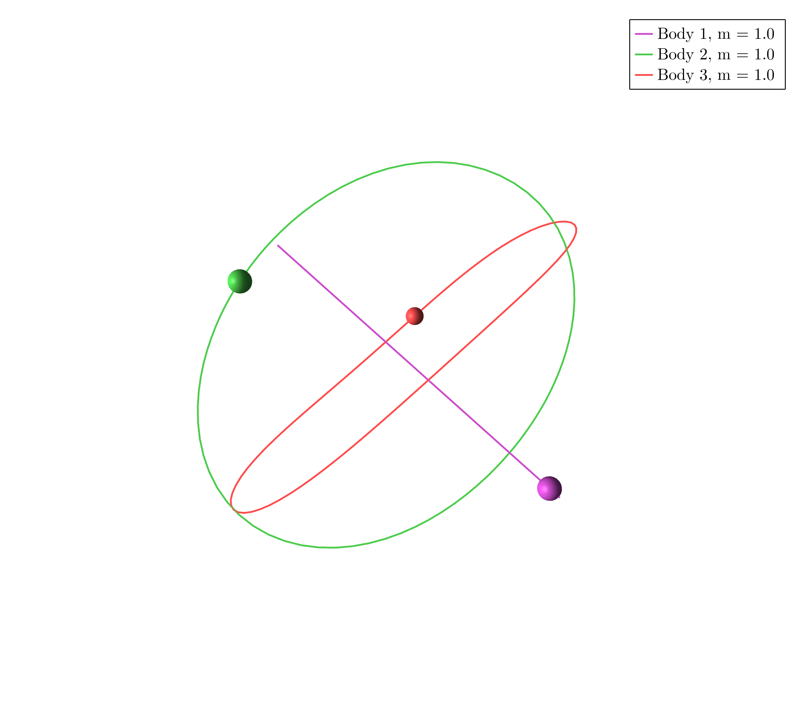
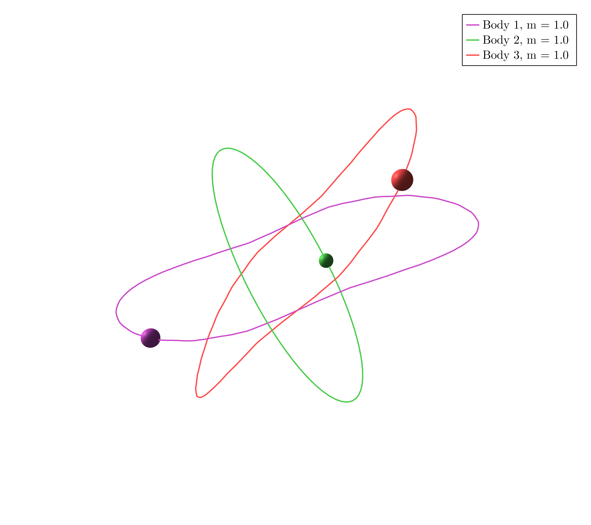

# Example 3
Download the Jupyter Notebook [here](assets/examples3.ipynb)


In $\mathbb R^3$ take three masses $m_1 = m_2 = m_3 = 1$ and consider the cyclic group generated by $r$ such that


```math
	\rho(r) = -\mathrm{Id}_3,
```
```math
	\sigma(r) = ().
```

```@julia
using SymOrb, GLMakie
P = initialize("3d_cyclic.toml")
```

### Orbit a)


```@julia
starting_path = [0.1629439766723737, 0.6085313169394081, 0.5060427231446483, 0.4907060221160303, 0.47462575028387244, 0.6160220570554484, 0.18616401957497009, 0.515345095810146, 0.3636776113140664, 0.4128609217731569, 0.33240836043888033, 0.7129943621835214, 0.4457080097218292, 0.934101992377902, 0.8250078000991556, 0.5178747770880521, 0.9694121703449209, 0.9901227978145012, 0.9040560152638281, 0.31428796099122225, 0.6538234767386694, 0.6963360576860536, 0.006873862494705674, 0.41400960333028103, 0.6040115891503206, 0.0666517546366352, 0.4631753405415846, 0.949122577570299, 0.7273338770463643, 0.8778920219868852, 0.9246888320407158, 0.8851942116007538, 0.6394109840589988, 0.5473793568037505, 0.9784369508866043, 0.5240492967792278, 0.4480733215036523, 0.7435768862834151, 0.29799029747523953, 0.6037440871852291, 0.40783758386358127, 0.9429898858983151, 0.26932468465329773, 0.4208758527720542, 0.1429273281140202, 0.8965549272654081, 0.8321475926052503, 0.6969886737065177, 0.6748604581415545, 0.4332123489210339, 0.02512994547087244, 0.10959514712058382, 0.04130930561133306, 0.283342533664378, 0.9465399059268432, 0.09770421585551992, 0.8643988163941289, 0.6101463316250976, 0.1393378540138972, 0.29332612923274715, 0.08171639736716241, 0.4809202996278519, 0.32871956403546687, 0.5118022119927985, 0.573479598348583, 0.26097555208759127, 0.9963358808746849, 0.37999159887811595, 0.7391915257202937, 0.5026443443198534, 0.4407726012585551, 0.5508185578894409, 0.11895227594047109, 0.6002000476073892, 0.9854546832127563, 0.9622131238282954, 0.1802520987785018, 0.8626796417309112, 0.06855327779409992, 0.48661677681344107, 0.9001608898841612, 0.7787370457885527, 0.3604180980768871, 0.3155017000940741, 0.6669337605532234, 0.809565232236322, 0.3120664151595066, 0.5562657235275708, 0.4019036371320578, 0.06350970212838314, 0.36435264250469557, 0.9854509958122775, 0.9336816249942573, 0.9242500511356173, 0.7177034906205386, 0.8503243241140582, 0.04232615014262031, 0.8743923567925914, 0.03782951180115934, 0.20493281959845022, 0.6930137397915718, 0.9182653714356539, 0.3938725923590105, 0.32476196838184823, 0.26755298457223686, 0.7024342860440047, 0.4871613415511139, 0.9392929436170357, 0.7938189117148119, 0.027091245401960395, 0.3690060033964895, 0.94386583412351, 0.34140859512306454, 0.5252853615641042, 0.8981849160264994, 0.40766960766147886, 0.983760382549508, 0.5178864901672253, 0.26240917227792326, 0.4325376310261204, 0.6862869960163325, 0.11994935410189678, 0.6193359930671958, 0.7326410248241925, 0.8971360845097588, 0.6589266599303693, 0.5041050677813652, 0.6599507150983418, 0.8924321852522519, 0.5096491305527096, 0.03873220477178407, 0.4661888093981468, 0.07049796639114592, 0.9487952683198765, 0.7999608628714457, 0.895796011947763, 0.16525057251098008, 0.42855608662341904, 0.687078049748251, 0.1282757829669834, 0.937735806792377, 0.344496519359036, 0.14189420426769717, 0.2539229579989468, 0.09764498414249734, 0.3673110053832175, 0.775963931678079, 0.09253280159485067, 0.6483752406685089, 0.7686301342065868, 0.5184806306806881, 0.8510349919034151, 0.7235692332510401, 0.260238649419535, 0.5340119918495897, 0.08821342758594952]
orbits = find_orbits(P, InitMinimizeMethod(ConjugateGradient(10), Newton(400)), starting_path=starting_path)
path_animation(P, orbits[1].fourier_coeff)
```

### Orbit b)

```@julia 
starting_path= [0.5627508151735956, 0.2245026454023763, 0.047902562344401156, 0.015483931867180334, 0.4434222426389327, 0.11055342493664588, 0.7874015745797072, 0.18202256741790368, 0.5935853899736211, 0.9946692567997564, 0.4825071875494319, 0.5448753713387486, 0.6918571547530552, 0.7350652659525964, 0.4517707360698673, 0.1409960679005512, 0.9676079530907247, 0.5066567633460827, 0.7440949324296754, 0.8062237643142438, 0.2236762908839246, 0.5976551364219982, 0.36540178543150237, 0.21211428094136897, 0.6898116217629762, 0.07341804717138711, 0.3899549435638947, 0.08298742266168502, 0.025969074916258106, 0.9803539227848965, 0.1559992890317874, 0.7758384866826127, 0.927526225533555, 0.28494519740494006, 0.6978227087541721, 0.021216771820538827, 0.3654613177739926, 0.619116461005552, 0.24756685306287285, 0.31037336398904136, 0.16144370788107099, 0.1285034409942709, 0.8604073653234365, 0.35979835232806756, 0.0350225410846976, 0.6695830763708639, 0.5461427770760476, 0.6476752570717529, 0.21889752127906958, 0.5308181732760379, 0.9354450582927707, 0.1209016210372954, 0.9211827703168296, 0.7750952684352447, 0.6335309816991562, 0.8635583974882107, 0.8253807219290371, 0.879853057382002, 0.6339436490570561, 0.7862298489744187, 0.15193162499598756, 0.11213083452724837, 0.8704776158178957, 0.7197678233529761, 0.9739112642619486, 0.3158134980339241, 0.5003544646263555, 0.5892591631931611, 0.8070367872030019, 0.8872660505900604, 0.9559092760786937, 0.16016361242386634, 0.5343086338257893, 0.8896937178842084, 0.625910004742278, 0.24430058003593647, 0.38679252037849043, 0.3188506237962805, 0.8746762887016759, 0.21004425361798196, 0.8838402848733138, 0.04469545356580151, 0.5301504345280255, 0.6871957209889193, 0.40577139736152046, 0.17316320394711604, 0.9070535630722831, 0.5632884866352799, 0.5277775252677965, 0.3506378291764337, 0.492592096422958, 0.008621519783497456, 0.9657448947384918, 0.6512782811225227, 0.565134347287581, 0.9191926811164207, 0.7167095749254101, 0.8262637467221198, 0.1758834534901912, 0.5203095472868061, 0.31222783179613844, 0.2837733347964133, 0.370741014224082, 0.3801525582045784, 0.14610573634895152, 0.30324753775459834, 0.08094258074445926, 0.7826692025988049, 0.8500900540978117, 0.04684972897694317, 0.23390850804704133, 0.7260886520683009, 0.4058404071916113, 0.019890953735561934, 0.362664993545335, 0.9853760923784791, 0.02373615514525118, 0.4528872960048258, 0.49088628061852446, 0.2927344618333718, 0.28423169750445876, 0.5198024759552446, 0.18839947140232816, 0.6272563686694408, 0.035427251951337, 0.8051077379540205, 0.9818516028721582, 0.6369776588230529, 0.22551339222261746, 0.022182864288922466, 0.8381824188023146, 0.2008410467152506, 0.8162103594088402, 0.5449496714785905, 0.7807737246933677, 0.965041657330134, 0.754024156229046, 0.3435741991083354, 0.8636814694585582, 0.2730856340057144, 0.4375869285135211, 0.8383490585551303, 0.44947718352661914, 0.4520639566567002, 0.3660816484608823, 0.7905820657810061, 0.9354847437416471, 0.6755131897476496, 0.9290486802688604, 0.6593886480723892, 0.2953479496164527, 0.025237620111959624, 0.916556331034111, 0.14819341202808212, 0.7399272918948132, 0.8323920055172893]
orbits = find_orbits(P, CompoundMethod(BFGS(5), Newton(200), BFGS(5)), starting_path = starting_path)
path_animation(P, orbits[1].fourier_coeff)
```