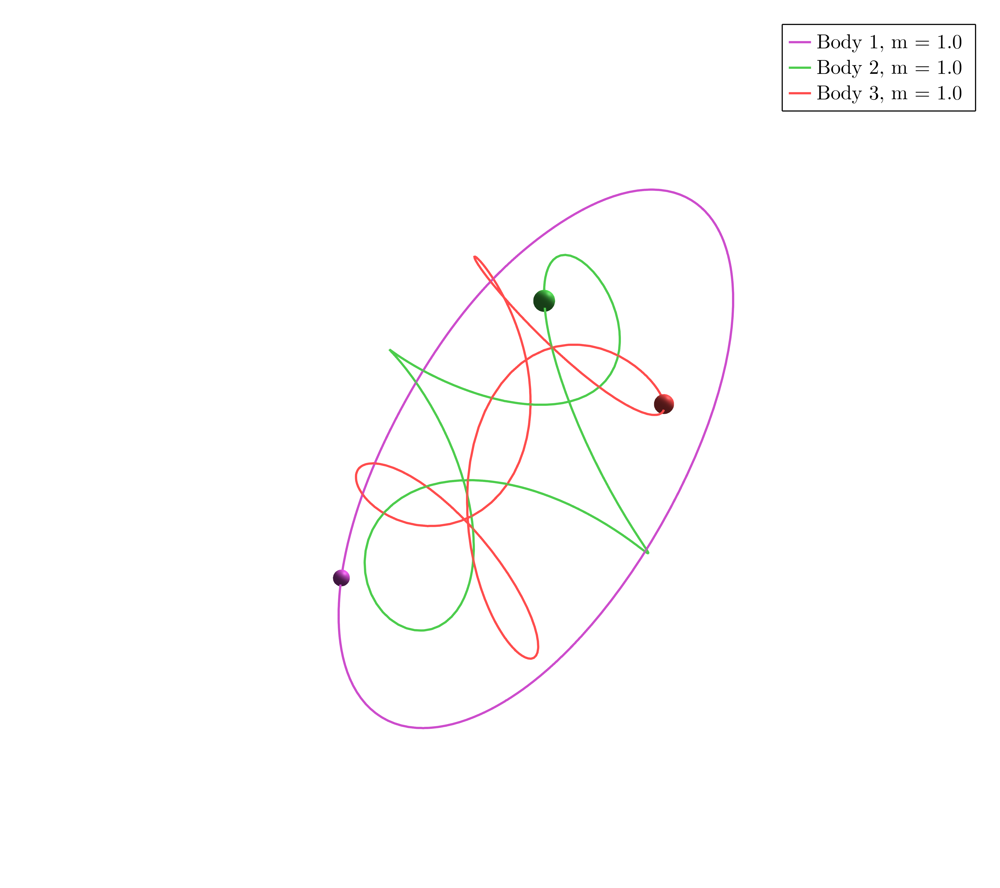
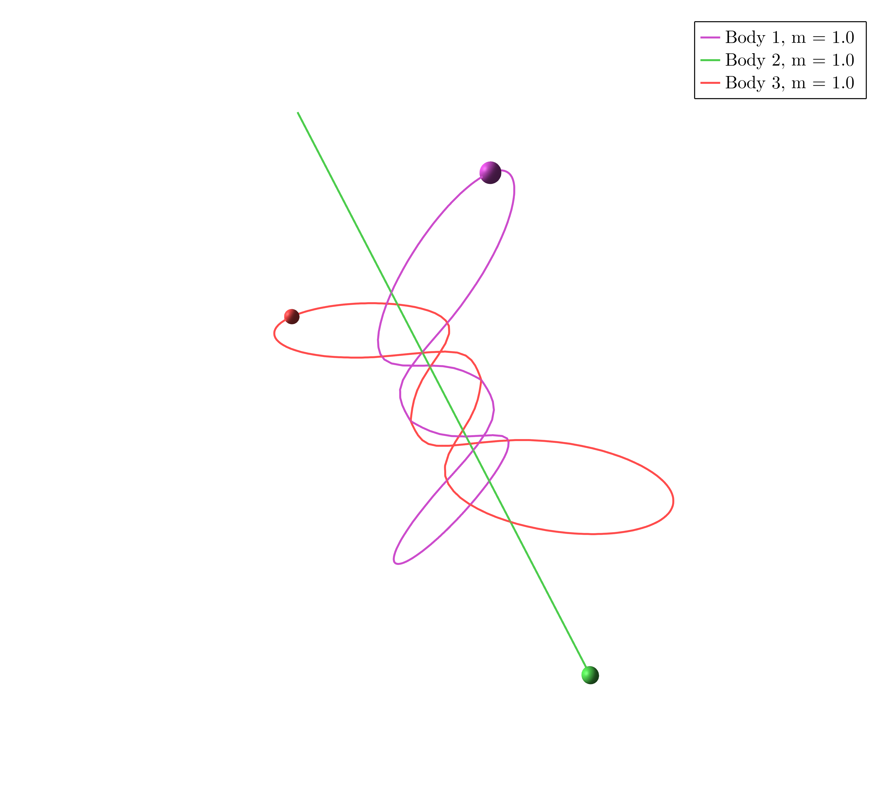

# Example 4

Download the Jupyter Notebook [here](assets/examples4.ipynb)

In $\mathbb R^3$ take three masses $m_1 = m_2 = m_3 = 1$ and consider the dihedral group generated by $r$ and $s$ such that


```math
	\rho(r) = -\mathrm{Id}_3,
    \quad
    \rho(s) = \begin{pmatrix}-1 & 0 & 0 \\ 0 & 1 & 0 \\ 0 & 0 & 1\end{pmatrix} ,
```
```math
	\sigma(r) = (),
    \sigma(s) = ().
```

```@julia
using SymOrb, GLMakie
P = initialize("3d_dihedral.toml");
```

### Orbit a)

```@julia
starting_path = [0.5234626895003243, 0.11452901689301276, 0.9165194518117988, 0.3806232168111633, 0.7762795771329101, 0.8589621335300416, 0.7875892638693792, 0.6573836331697943, 0.12475904827727924, 0.2834878137135739, 0.4823053091510704, 0.5065274952408957, 0.08857445434422673, 0.9346627640901793, 0.5585888786310821, 0.1873485960460689, 0.6903320933093973, 0.2624479709681865, 0.05515825296214838, 0.8089127430631091, 0.6352820388416521, 0.12961029902537513, 0.9018571196584929, 0.8606293875995589, 0.9979428432337983, 0.18648220466143495, 0.4825817058415073, 0.29277776866712146, 0.14671901406906118, 0.47145779927094467, 0.2560833274566513, 0.9807801538904511, 0.4464523493524212, 0.0418866739379139, 0.24676782019986332, 0.7811390335800126, 0.46525853500929193, 0.550646579060978, 0.1671215246227754, 0.89188935459645, 0.43267462704568016, 0.9690451531025134, 0.4822770504538362, 0.6360768144080547, 0.2271114542516085, 0.7028934872379426, 0.12711797226920374, 0.8055923639359993, 0.9884235477995069, 0.3466447438537055, 0.2745267324187477, 0.3701113052585816, 0.9388506285644597, 0.7976604412616487, 0.02312030796903941, 0.17310381299360567, 0.7490379646657237, 0.5003422257501761, 0.07293456440452006, 0.8963002087838549, 0.5173528989274568, 0.6633838886988987, 0.890268702188056, 0.4518303438001613, 0.2596731758870571, 0.259005190912422, 0.11619894414956577, 0.5528458362028794, 0.3943998194044125, 0.7655049828388745, 0.5846474625365466, 0.16317625891233867, 0.5033447984178404, 0.3875559118127313, 0.6331801919092753, 0.565134795911303, 0.9833154333236103, 0.8888503673504765, 0.252815810297081, 0.7424172521498617, 0.13242236880348646, 0.22536761818668027, 0.5110690165148297, 0.1962418981697236, 0.9997855359161902, 0.6352606553076383, 0.1841053108148939, 0.8679183792632307, 0.7051022606424904, 0.5587139213292894, 0.8604850023934182, 0.08120428654973066, 0.906176301889268, 0.966588426671722, 0.1634945859009156, 0.7870395832491015, 0.7339547148074818, 0.8450027657418182, 0.5061533804292315, 0.9793124656223997, 0.08149454408447665, 0.535254661177609, 0.19580291537395267, 0.8751027832967936, 0.8450290267622532, 0.6852690772779615, 0.6340652202287202, 0.3789164701947806, 0.3522915989772246, 0.49155665463380405, 0.9686807246793562, 0.614702756004593, 0.6949776677345069, 0.2152217581280016, 0.16199418555177325, 0.7464787501635055, 0.40981496911329385, 0.4569305663407497, 0.3395126699997668, 0.7040023236190717, 0.3226010014112545, 0.32775021404505444, 0.8990519677026563, 0.7957651350830194, 0.857954920746126, 0.6044519634106241, 0.42992809875582716, 0.9785148127651756, 0.022174155536436646, 0.8895326329664814, 0.5870958837740043, 0.029604880644821363, 0.875677859594753, 0.24045715385244093, 0.19709671066832135, 0.33121437868712655, 0.9397489381124425, 0.055337974939651646, 0.28694278836124154, 0.5530060843536054, 0.6886850840723017, 0.1080388560635851, 0.3246750700095088, 0.0404673540791356, 0.858528959677389, 0.6167325488933497, 0.5465608589110491, 0.011684352135280185, 0.2820496169541744, 0.11484097349809685, 0.6675000037581842, 0.9931713920492081, 0.14657113670705124, 0.32020916836617563, 0.9580109285675807, 0.6796198893288874]
orbits = find_orbits(P, OneMethod(Newton(200)), starting_path=starting_path)
path_animation(P, orbits[1].fourier_coeff)
```

### Orbit b)

```@julia
starting_path = [0.08664054786702557, 0.9439551576370984, 0.550132040789342, 0.9707081207845633, 0.21165320406105204, 0.5665455840183247, 0.18893871557756836, 0.7309572096263751, 0.14045466704101328, 0.29210694900138023, 0.9315953044383289, 0.6640451937616499, 0.2760334187651061, 0.23541998845782075, 0.5382740896234304, 0.8320043017673999, 0.8752141468614102, 0.19850838043347607, 0.19923592498123366, 0.7271367926905162, 0.4250980306872256, 0.3344858969975206, 0.27471263029231696, 0.1009925291382272, 0.7751477487813371, 0.3788715042146408, 0.24779801050399353, 0.10151646479363952, 0.11527052891502543, 0.2292299492920975, 0.27815146794126944, 0.14429850384643828, 0.4404561773722995, 0.4540047775203936, 0.6104002863692688, 0.20607081063283428, 0.2602106944161109, 0.3598788330891187, 0.15152240528867444, 0.1522195198091414, 0.1731262164758588, 0.026431289234850164, 0.1420808877797557, 0.9906267596606511, 0.9679674692811375, 0.826164951391708, 0.021922557360634753, 0.3048967768885079, 0.982147692559136, 0.41073165590153304, 0.30737108018172266, 0.451538600388384, 0.6372254882688961, 0.09185756812025192, 0.6659774447448429, 0.585520233936992, 0.3381980371447868, 0.3845389315281865, 0.8822212939100039, 0.6821958244719023, 0.9480374602547881, 0.25536034712769995, 0.9572073855103923, 0.5524114959988061, 0.8391298600194469, 0.12098262991637077, 0.6030938848183857, 0.49647083534445946, 0.3931642943297644, 0.8375219425376914, 0.2966500821699545, 0.3649373187792101, 0.6381976045113198, 0.2813274790608684, 0.4119262705505432, 0.12103902510874864, 0.05205343434905996, 0.38499116312849035, 0.2980820046390179, 0.0848249235138202, 0.038287213655554986, 0.8088018617633248, 0.4158017939136879, 0.49884651849073314, 0.6466494604580496, 0.29523755071105695, 0.48758469694368345, 0.8302061465909574, 0.21346710162420846, 0.11047147625080589, 0.13524643007867265, 0.9908211155730442, 0.6429218691156692, 0.6583445185361276, 0.19557154046763825, 0.39936720613091403, 0.5024832579203559, 0.38619256847284655, 0.7672495204589803, 0.6084061513571115, 0.3844551896140652, 0.16172449225157537, 0.6642116071946567, 0.46965930259784516, 0.24133587960942848, 0.7683724514387952, 0.22845872975068904, 0.22295260449266685, 0.2542639489286175, 0.46646721598382934, 0.7670575088587696, 0.11383323096283304, 0.16710063030688194, 0.8134383498478068, 0.7102507249449428, 0.32439379953803016, 0.15800633243043627, 0.1609686263876966, 0.609936985051832, 0.38163573702519693, 0.7485455006858533, 0.8933417838877553, 0.8079705716830324, 0.03947333114004958, 0.8667742800435854, 0.6595923239631846, 0.6179825163020398, 0.9119332439103552, 0.6390144344218381, 0.8683301100993565, 0.06510284764558816, 0.30125854971486465, 0.37267455787673576, 0.4334258156143833, 0.6730161783873632, 0.9319742913872592, 0.05831924821354639, 0.12527793695560896, 0.8175261376090682, 0.6939513992062113, 0.13920897492169737, 0.48915411264811837, 0.10773305662584598, 0.4351366942254663, 0.8463586440150042, 0.37493725532423594, 0.5359365733789102, 0.8708869424026084, 0.383737733077018, 0.7188873855378718, 0.2872171941392051, 0.604470918548302, 0.7291589915348903, 0.10671913613503037, 0.4007286459570407, 0.6380104919093893]
orbits = find_orbits(P, OneMethod(Newton(200)), starting_path=starting_path)
path_animation(P, orbits[1].fourier_coeff)
```