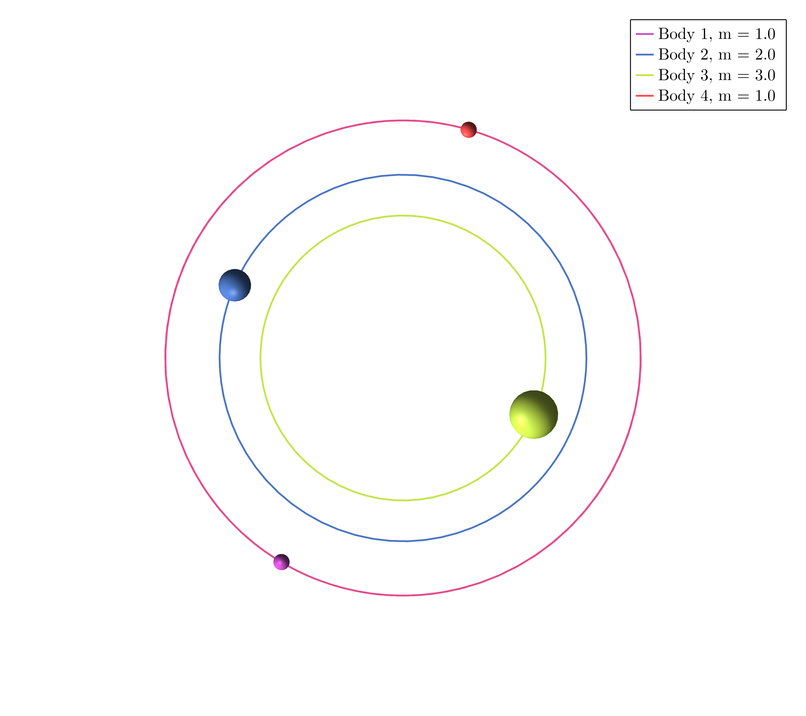
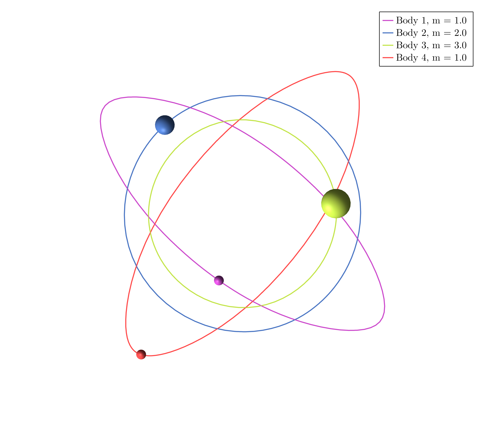
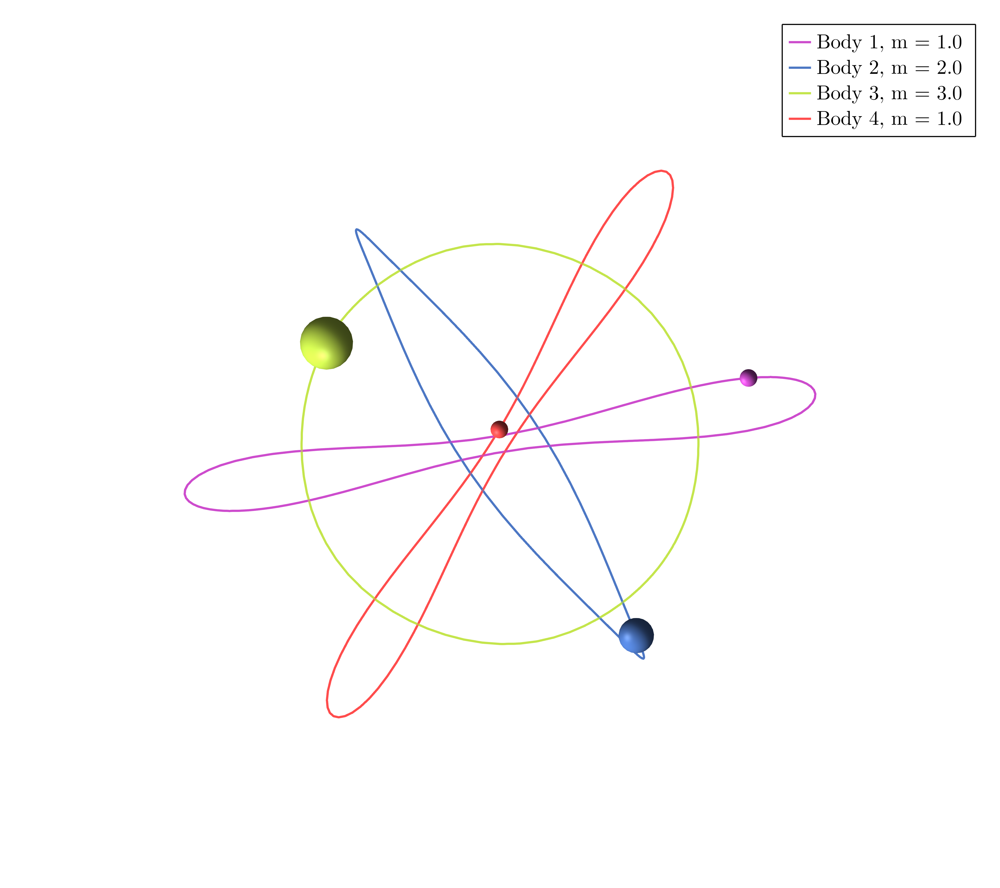
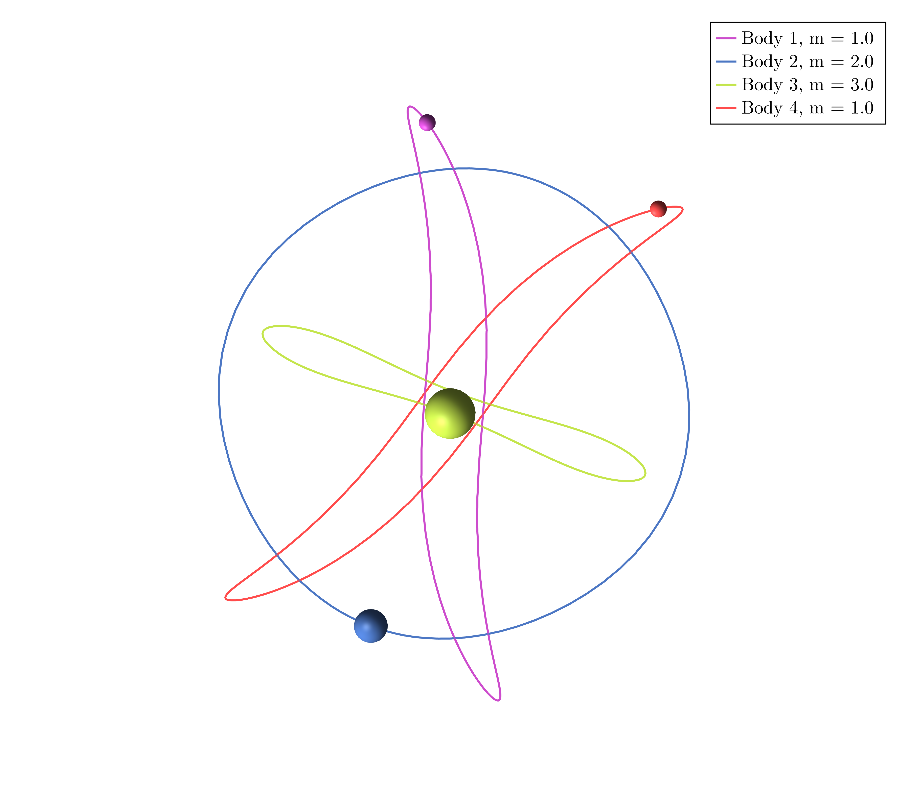

# Example 5

Download the Jupyter Notebook [here](assets/examples5.ipynb)


In $\mathbb R^2$ take four masses $m_1 = m_4 = 1$, $m_2 = 2$, $m_3 = 3$ and consider the cyclic group generated by $r$ such that


```math
	\rho(r) = -\mathrm{Id}_2,
```
```math
	\sigma(r) = ().
```
```@julia
using SymOrb, GLMakie
P = initialize("4masses.toml")
```

### Orbit a)


```@julia
starting_path = [0.6555260520068706, 0.07148768734021782, 0.3870490532872224, 0.03489552424022646, 0.3542273554524905, 0.3435956071386338, 0.7502521847494905, 0.7086644541484166, 0.34330888306050533, 0.08213264579468493, 0.2546117305672574, 0.8247218982801341, 0.7848944790783701, 0.8062023549879922, 0.9939479262146792, 0.9364876647742614, 0.47143230720557194, 0.9176863757298092, 0.42779147306307974, 0.7081062673749566, 0.8850935358819104, 0.555426314700793, 0.5661230716572457, 0.953307253866469, 0.4547071311712404, 0.9026354322362803, 0.8191349993783271, 0.13751652575842777, 0.6832314836444453, 0.3336143351415417, 0.7120870512378852, 0.7042761485091488, 0.9729946568922206, 0.9926483268682136, 0.4154019083640056, 0.955338632191752, 0.4590391285665043, 0.4884428262354009, 0.17760021801612025, 0.8230035297440479, 0.5749492300463429, 0.7745569192756719, 0.25283371074325645, 0.8067594443290397, 0.757698511770422, 0.3044615719576399, 0.5879331026928722, 0.37865507078679683, 0.04443202668406587, 0.36124047847615126, 0.378188227201422, 0.08620320383631364, 0.23616301583175336, 0.8326359732400498, 0.6167028694373479, 0.6010606101995805, 0.491426717641529, 0.6417978285895976, 0.9293777441637536, 0.6962762137197781, 0.19209679318756534, 0.6743457442004909, 0.10907093549257763, 0.12168938128627982, 0.5279564566834571, 0.7148582574301489, 0.5411910071305193, 0.3913323750939971, 0.5979415741033044, 0.5667451149791923, 0.5476368231165479, 0.7273373147092534, 0.7655646789310175, 0.7682616476733888, 0.6707681241520257, 0.8021738821303981, 0.19345239959002336, 0.8052762123957337, 0.3297213725154132, 0.22210913462891424, 0.11534330824940298, 0.42999260031173603, 0.39294881927783454, 0.23422054561911598, 0.01942705767755759, 0.10674346233206422, 0.9421710375219473, 0.9215404517760791, 0.4752702226418183, 0.8326456208978958, 0.17842085972873856, 0.24387338841688833, 0.7974478765105599, 0.45711934802736254, 0.6966567054184397, 0.24051242111934912, 0.5948979373424415, 0.6998075920979819, 0.3943421823756612, 0.9530024747029873, 0.04664473328960039, 0.2489092003911807, 0.05147377948672671, 0.2969447731066167, 0.25625744040969434, 0.6826665684464889, 0.8875413102642298, 0.2532038315147458, 0.6091039336884194, 0.40295161677917113, 0.4274722476443893, 0.7365035369758011, 0.1967416784121715, 0.594410851318186, 0.15945089385040967, 0.8545590742078245, 0.28316725787755737, 0.6012978083446208, 0.5231948650348499, 0.4980244880015807, 0.9401007752444815, 0.22875201523817856, 0.36470349820557624, 0.6496633570371202, 0.03970131524616838, 0.845563185014064, 0.9651256393848648, 0.8221080769084449, 0.9781297617511269, 0.888320042638358, 0.2650351071660034, 0.5771356328273264, 0.34733343410774975, 0.39341588464413846, 0.09872062967530093, 0.8342346819050588, 0.09517044105453065, 0.46842434659663523, 0.4750935752384754, 0.01878045635533976, 0.9743071129628086, 0.13014806701402382, 0.6825512254702768, 0.3810618778743815, 0.38833229887130216, 0.6349606975535015, 0.3274056315009398, 0.19063989797340064, 0.8304325075196507, 0.34983933976339643, 0.18014505507484735, 0.3800166806374706, 0.41374923355390836, 0.8101205807208279, 0.4066805505705101, 0.3087660555053]
orbits = find_orbits(P, OneMethod(BFGS(200)), starting_path=starting_path)
path_animation(P, orbits[1].fourier_coeff)
```

### Orbit b)


```@julia
starting_path = [0.8259019981427175, 0.1593708478565562, 0.5082608328570759, 0.5941403429232924, 0.5391827001452293, 0.16198571007262696, 0.17744274087045342, 0.5978186427101475, 0.4282622561339653, 0.8021344303512444, 0.56330649212942, 0.18406589029017162, 0.9210188743639083, 0.2435250933162325, 0.8430331354227988, 0.6834806480344795, 0.004540339228797152, 0.704247746326442, 0.8152710129171569, 0.7099584224335163, 0.6149807105262578, 0.4992759808427861, 0.7885676538516315, 0.8223456200221863, 0.16724145336627616, 0.45785624976356853, 0.984323252437187, 0.7380475488887863, 0.226465591926583, 0.7714958798565485, 0.3005642631612574, 0.838667975767269, 0.5380298131519191, 0.5766596895965108, 0.0069753436726698315, 0.02035423271787873, 0.17520838285273865, 0.21320708247390263, 0.7914775105678135, 0.11408755609587784, 0.34104172047235637, 0.6861982234597105, 0.1671970556408915, 0.9659139385028414, 0.11186834714663807, 0.9591941406664098, 0.057613898778105965, 0.17566255585749946, 0.07166637937225717, 0.9777891806096162, 0.8010890194114412, 0.9064166938382716, 0.27743666187800486, 0.7245009658911403, 0.29291958040679456, 0.7690107401947522, 0.49473762554808864, 0.40201990467933746, 0.7294821577568208, 0.36553547722816915, 0.9669812029687611, 0.19140049176128093, 0.663985060947772, 0.5157884728319896, 0.839530672157327, 0.6487740838122226, 0.715668364262681, 0.9954073982719136, 0.9980162253626296, 0.34521907637158933, 0.14176427203082143, 0.9949906744202086, 0.6608500212222461, 0.060955504844224406, 0.7838674636477826, 0.7544496485462264, 0.1568979042895804, 0.27503383229421574, 0.63593944749912, 0.20629955588411097, 0.23764519938991802, 0.4583012323904013, 0.630452067976086, 0.1763482977823959, 0.11709655327775448, 0.22269000332271782, 0.5179318106242604, 0.35935490436589623, 0.2670645902434573, 0.9824163889476789, 0.14833906959203735, 0.12446717798053752, 0.20260558555736097, 0.7345427686160094, 0.5249814460347441, 0.8598810251066024, 0.651883989425647, 0.7015547102252444, 0.24312793027762591, 0.6424227012909132, 0.9210664093855891, 0.2067613362953189, 0.7999899030697233, 0.4842983061889923, 0.7089265184995829, 0.15979925536120787, 0.14231711606904773, 0.0766443169609512, 0.3425589007658404, 0.8204630790304279, 0.6099803083262205, 0.3105830490428334, 0.3469272343970733, 0.8532726435375935, 0.12057622599471651, 0.546309864751098, 0.5790817796828223, 0.2297036348491993, 0.08289704823008914, 0.4404185244336023, 0.5836666825973217, 0.6440093488528019, 0.2957532155832703, 0.6291626818759704, 0.8197107602224708, 0.9349542858574805, 0.12885656684037183, 0.8094673396009888, 0.7712774391511924, 0.5664224576323189, 0.11092667746165219, 0.7278410708363807, 0.13146384613262485, 0.12754443711165597, 0.39444336397051927, 0.07734467912430643, 0.4879391055968342, 0.7497026201499908, 0.9348484444771168, 0.09443199507777611, 0.3256879679552406, 0.4690726805261115, 0.47436944977164064, 0.13977433041188692, 0.06686771433114413, 0.28144420292502315, 0.18688102531591233, 0.8000870815261313, 0.44496605617705143, 0.3033695775978762, 0.7138673476473432, 0.35808401378823695, 0.5414155843401932, 0.7161924180351965, 0.9517317224953461, 0.07433285187273442]
orbits = find_orbits(P, OneMethod(BFGS(200)), starting_path=starting_path)
path_animation(P, orbits[1].fourier_coeff)
```

### Orbit c)


```@julia
starting_path = [0.7044334623373564, 0.9126755202786617, 0.9306640183429739, 0.7609148915383509, 0.25336528699036165, 0.40629608210149015, 0.7760987080037516, 0.3395284009820707, 0.7086627544783839, 0.07455126858735794, 0.034851075933972964, 0.8729012017732372, 0.903796980275419, 0.2489687420835951, 0.42421219976646307, 0.4183468512037096, 0.17200382853925522, 0.7939322921271075, 0.7001919465603559, 0.8882654249706657, 0.4578817449494068, 0.3201599734066378, 0.07311558049841527, 0.8344632252672812, 0.6484178528400172, 0.34137199554629716, 0.16521228834768742, 0.7635439544400928, 0.2318177134802546, 0.07900812013171654, 0.9690599980798823, 0.16395838478043745, 0.15179878456422502, 0.719576909955197, 0.47991956671562663, 0.6599640781314833, 0.3707042604243407, 0.6487716049232488, 0.31097585984306086, 0.8941822128538932, 0.03299712427158241, 0.48406818909594596, 0.06766960939542899, 0.31599957506181264, 0.6057742616466884, 0.1858726630463685, 0.4665955626642322, 0.2686904207607015, 0.08739050246753055, 0.7262988944859452, 0.5437997262360997, 0.06935634681921499, 0.17776332041771914, 0.3309159336652081, 0.16602189667715506, 0.10948545274316068, 0.9194428639164002, 0.023848038895511237, 0.8110162127917598, 0.2232093412747178, 0.2583758325592169, 0.3156060015682628, 0.7090444382989742, 0.6079611553973312, 0.7748820428542378, 0.17100668321901336, 0.17564722100393648, 0.9845140736019362, 0.9446074424697013, 0.07493413288466344, 0.08991807436353794, 0.7557149357896752, 0.9219900566282724, 0.42907371845066933, 0.8068344247790336, 0.09398556851980566, 0.5733469938095288, 0.5017794958435956, 0.13641508525295054, 0.5086203070817003, 0.7591828697191417, 0.3812291480630172, 0.21064879809862536, 0.908112384210975, 0.360425625322911, 0.46253108452243896, 0.5082616134211784, 0.030172377707931353, 0.063970475426392, 0.020404280504685235, 0.5678366284551046, 0.031818518429249654, 0.3689692311815278, 0.8517038050205016, 0.6199948966775256, 0.20625385583924638, 0.4285251573998907, 0.06491062366504696, 0.5478171562218332, 0.9897217645476031, 0.5977119504602878, 0.9157193815032422, 0.1142896454857385, 0.38352154779526015, 0.7772716319396921, 0.4242567350508507, 0.5529686603275684, 0.9599952038258067, 0.9230683745522708, 0.41955395083626545, 0.9638841222980277, 0.9040904624448761, 0.7829283488455329, 0.3438311166987871, 0.5526452956674538, 0.07962654186306384, 0.9033393761746618, 0.3757215097165526, 0.569581725438745, 0.19482978759286285, 0.22586810035840865, 0.5902283287266578, 0.4012374878141687, 0.6057489650555306, 0.08802682651405991, 0.8631512086700002, 0.8742143923735891, 0.014085793147209147, 0.9347901732509846, 0.5221064977017984, 0.9071508295152537, 0.9063665940898019, 0.9646146215748564, 0.9846185311464549, 0.5515975808700219, 0.47008633554196955, 0.7304633009744242, 0.5869524923059855, 0.4411038905612459, 0.5829998328886613, 0.5447345324630452, 0.39240408876890787, 0.11871433391476016, 0.19397909720909257, 0.5752849436453268, 0.5328146099067934, 0.5055266269477748, 0.7010917128672077, 0.2574311792383557, 0.41253877021217555, 0.2626588153630337, 0.17491770042220944, 0.28219304573281934, 0.8864885720140284, 0.9467209013557116, 0.5914809518085888]
orbits = find_orbits(P, OneMethod(BFGS(200)), starting_path=starting_path)
path_animation(P, orbits[1].fourier_coeff)
```

### Orbit d)


```@julia
starting_path = [0.8428887831335327, 0.5217881652778122, 0.7543372443389089, 0.17231947710152984, 0.30875449287545276, 0.5567510448298288, 0.34508914476135255, 0.9145124655166581, 0.9436052317017513, 0.7210542193203794, 0.9403392935306731, 0.44656208773232153, 0.5455048235105625, 0.38752465690130955, 0.20972640110230722, 0.2480775581579051, 0.8792943921307341, 0.9910033535818814, 0.6875849257452455, 0.4536154109258005, 0.6514284892096147, 0.40740134263047556, 0.25833410870743767, 0.8081613138968705, 0.24247151878540107, 0.9766003796773882, 0.7652815619554678, 0.14644156848009515, 0.32837485459411486, 0.6934273150413127, 0.31643035493926797, 0.28969893488137755, 0.14227840614887444, 0.7253070863410362, 0.069855671956226, 0.5896645875198863, 0.3181660447913718, 0.4170002838897008, 0.06554435825132054, 0.6929686640374099, 0.8650119980651176, 0.99331787702797, 0.7247808046609975, 0.21501926477548672, 0.5886164904368356, 0.21239449275016664, 0.224969346899081, 0.38123193804658184, 0.32688755260121727, 0.6330906282814245, 0.0531846875026607, 0.6864508724020492, 0.16151006577739369, 0.45535954971158854, 0.6947957709671889, 0.9207736959680426, 0.6355842078254293, 0.8811200022708786, 0.6385502231618098, 0.32249391543532424, 0.855250446733014, 0.24471984934539492, 0.9005281287231609, 0.8581950031923586, 0.5509582323760783, 0.23213780800758244, 0.6656825785600525, 0.612554096698436, 0.009282416819522243, 0.5121506407575209, 0.6519583512908795, 0.7529163456911708, 0.8909377401260814, 0.3686298420183812, 0.031026408671692374, 0.06935375493049145, 0.6179218179580923, 0.30539932983959406, 0.9933172034590529, 0.3925959633252528, 0.8676266561653518, 0.5643555406234546, 0.9708183290209578, 0.9178925699049628, 0.09523509529996643, 0.1673265026592783, 0.34562665960094907, 0.7878574710044867, 0.10939699889050869, 0.30240923049171975, 0.5721220487769174, 0.01303183816547715, 0.6303743768962918, 0.006701346916702766, 0.9970966770181642, 0.7801514244763226, 0.34598745165690514, 0.8503342537534269, 0.8025934696363461, 0.792740985312257, 0.15573374335051327, 0.8072655502605213, 0.9560310632712545, 0.5911458846503529, 0.0823186158945437, 0.8703412302976876, 0.06534311154926453, 0.8304800078215906, 0.023482680289296676, 0.9797840543053707, 0.8685896329548163, 0.846688998747121, 0.8834019861104981, 0.8406040735051354, 0.2600795114529443, 0.5460834781867275, 0.8273837462950056, 0.6438818189770484, 0.6814230407553785, 0.16918062404855783, 0.21227876613991958, 0.25115538876599086, 0.906709707723428, 0.3024655844871825, 0.3589537069606521, 0.48282707677130765, 0.7827511896928622, 0.622425544493838, 0.7142787291992528, 0.6443854345606931, 0.589204613703931, 0.5758209767641788, 0.36680232632763654, 0.25154588999932814, 0.5473042501456411, 0.6897862721840093, 0.8982571501755952, 0.5859033854124976, 0.1665293862196412, 0.46019841017750707, 0.03700025736345769, 0.03961680469394335, 0.26854984746948773, 0.6095761953108455, 0.7385584286457465, 0.37606870955328586, 0.6601556468002371, 0.10453826642472308, 0.5167144773906017, 0.19676742055971996, 0.8230897058829103, 0.7521740967701624, 0.1911326792835516, 0.11772591414823896, 0.5515240781312467, 0.1976387846614155]
orbits = find_orbits(P, OneMethod(BFGS(200)), starting_path=starting_path)
path_animation(P, orbits[1].fourier_coeff)
```